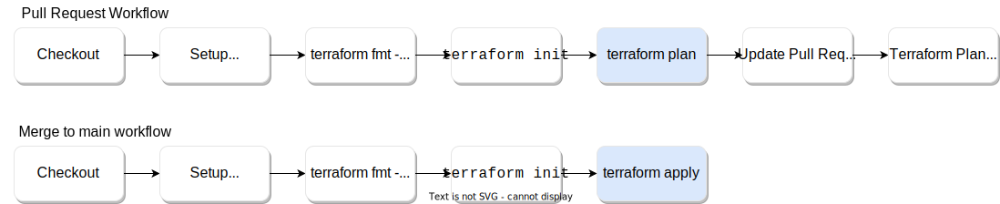

# quickstart-terraform

This quick start demonstrates a simple GitOps workflow which can be used to
configure and manage Cyral using Terraform. The example includes using Terraform
to:

* Track a **data repository**.
* Define a **data map** for the repository's sensitive data.
* Define a **policy** to enforce access to that sensitive data.

Ultimately, this quick start will help you enforce [security as code][1] using
Cyral and Terraform.

## Using this Quick Start

This quick start can be copied and used in a standalone GitHub repository to
take advantage of the automated workflow. Alternatively, if you just want to
play with the Cyral Terraform provider, or have another CI/CD platform that you
want to adapt this workflow to, please feel free to use this code as a baseline
to build from.

### Prerequisites

* A functional Cyral deployment. If you don't have one, please
  [register for a free trial](https://cyral.com/register/)!
* A set of Cyral API Client Credentials (client ID and secret).

To use the automated GitOps workflow:

* A [Terraform Cloud][tfcloud] account (a free account is fine!).
    * A [Terraform Cloud API token][tfcloud-token] - generate this in Terraform
      Cloud User Settings. Click on "Create an API token" and generate an API
      token named "GitHub Actions".
* A GitHub account where you can create a copy of this repository (to interact
  with the automated GitOps workflow).

Optional, but recommended:

* A Cyral sidecar, deployed and functional.
* A database which you want to be protected by the sidecar.

### Using the GitOps Workflow

1. Create a fork of this repository, or copy its contents into a GitHub
   repository in your GitHub account/organization.
2. Configure the following repository [secrets][ghsec]:
    * **CYRAL_CONTROL_PLANE** - the address of your Cyral control plane, in the
      format `<hostname>:<port>`
    * **CYRAL_CLIENT_ID** - the Cyral API credentials client ID
    * **CYRAL_CLIENT_SECRET** - the Cyral API credentials client secret
    * **TF_API_TOKEN*** - the Terraform Cloud API token, described in the
      previous section.
3. Create and checkout a new branch, e.g. `git checkout -B quickstart_changes`
4. Make the following required change to `main.tf`:
    * Change the `organization` value in the `cloud` block (around line 10) to
      your Terraform Cloud organization.
    * _Optionally_, make any other desired changes, such as providing the
      host/port of a real data repository you wish to track, or changing the
      details of the policy included in the configuration.
5. Create a pull request on your copy of the repository with some changes,
6. Inspect the output of `terraform plan` in the pull request.
7. Merge the pull request to the `main` branch to trigger the `terraform apply`
8. Inspect the Cyral control plane to see that the resources were created by
   Terraform.

### Custom Terraform Runner

If you don't want to use the GitHub Actions workflow, feel free to run Terraform
by hand or in some other task runner / CI/CD engine, (and optionally remove the
Terraform Cloud configuration if desired). The workflow outlined below should be
standard enough to run on any CI/CD platform.

## GitOps Workflow

This quickstart presents an example of a simple automated, pull-request driven
GitOps workflow:

The specific workflow automation in this quick start is powered by
[GitHub Actions][2] (see [terraform.yaml](.github/workflows/terraform.yaml)),
although the general principles and steps should apply to any CI/CD automation
platform (GitLab CI/CD, BitBucket Pipelines, CircleCI, etc.).

The workflow starts with a GitHub repository containing some
[Terraform configuration](main.tf) on a single `main` branch. Any changes made
to the configuration are made on [short lived feature branches][3]. A
pull-request is created for each feature branch when the change is ready to
be reviewed. At that point, the workflow runs a formatting and validation
checks on the configuration, followed by a `terraform plan`. The results of the
plan are added back to the pull-request as a feedback comment, so developers
can review the output and ensure everything looks good. Once the PR is approved
and merged to the `main` branch, the workflow applies the configuration by
running `terraform apply`. This step _actually_ creates all the resources
defined in the configuration on the Cyral platform.

### Terraform State

Note that the [Terraform State][4] file (`terraform.tfstate`) is generated and
stored in [Terraform Cloud][tfcloud] in this example, for simplicity. Terraform
requires the latest version of this state file when executing `terraform plan`
and `terraform apply` to ensure accurate results. Each time one of these
commands are run, Terraform pulls the latest state file from Terraform Cloud and
uses it to evaluate the work it needs to do.

You can remove the Terraform Cloud configuration for this quick start if you do
not want to use Terraform Cloud. However, we (and HashiCorp themselves) strongly
recommend using remote state management, as opposed to managing the state as a
local file. While there is nothing inherently _wrong_ with the local file
option, in most scenarios you probably don't want to do this and instead opt for
a [remote state][5] option. This will allow better collaboration between
developers, as well as more secure storage of any sensitive information
contained within the state file.

## Next Steps

Feel free to use this quick start as a foundation for managing your Cyral
infrastructure and security configuration as code. The Terraform configuration
here can also be combined with any existing Terraform you may have, such as
configuration to stand up resources in AWS, etc. You can take this further by
standing up your cloud resources (such as databases) and protecting them with
Cyral within the same Terraform configuration! Also, you can experiment with the
GitOps workflow, perhaps adding concepts required approvals, etc. It's really
up to your imagination!

Please view the [Cyral documentation](https://cyral.com/docs/) for more details
on how you can use Cyral to protect your data.

## Additional Links

* https://cyral.com/docs/
* https://registry.terraform.io/providers/cyralinc/cyral/latest/docs
* https://learn.hashicorp.com/collections/terraform/automation

[1]: https://cyral.com/white-papers/what-is-security-as-code/

[2]: https://github.com/features/actions

[3]: https://trunkbaseddevelopment.com/short-lived-feature-branches/

[4]: https://www.terraform.io/language/state

[5]: https://www.terraform.io/language/state/remote

[ghsec]: https://docs.github.com/en/actions/security-guides/encrypted-secrets

[tfcloud]: https://www.terraform.io/cloud-docs

[tfcloud-token]: https://www.terraform.io/cloud-docs/users-teams-organizations/api-tokens
